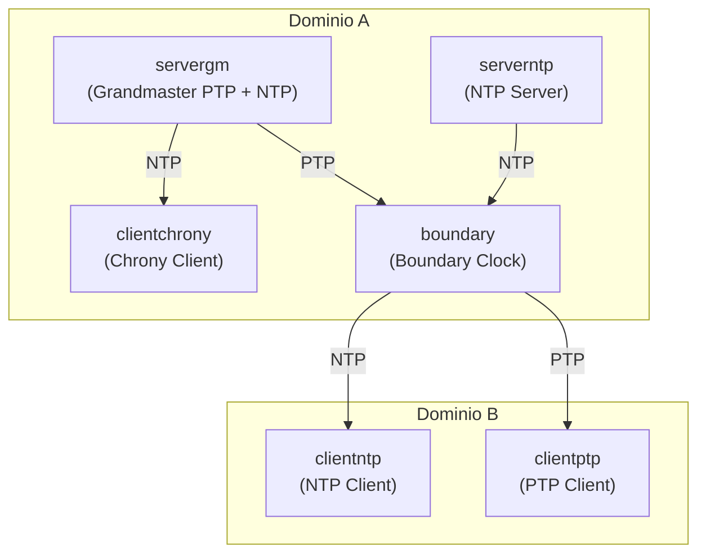

# Fase 3 — Scenari semi-realistici con disturbi (tc/netem + tbf)

---

## 1. Obiettivo della fase

La Fase 3 introduce condizioni di rete degradate **riproducibili** e **parametrizzate** per stressare i protocolli di sincronizzazione temporale (PTP, NTPsec, Chrony) in scenari semi-realistici.  
Il degrado è ottenuto tramite **Linux Traffic Control (tc)** con:

- **netem**: emulazione di ritardo, jitter, perdita, riordino (impatti temporali/probabilistici).
- **tbf**: limitazione di banda (rate shaping) tramite Token Bucket Filter.

Gli scenari sono definiti come triplette/quadruple “Low/Medium/High” e applicati in modo sistematico in test separati, con log salvati per scenario.

---

## 2. Struttura dei file della Fase 3

Directory dedicata:
```text
scripts/netem/
├── scenarios/
│   ├── low.conf
│   └── medium.conf
│   └── high.conf
│   └── scenario_matrix.md
├── apply_netem.sh
├── cleanup_netem.sh
├── bootstrapT3.sh
```

---

### Razionale progettuale
- `scenarios/*.conf`: **parametri** separati dal codice → cambia lo scenario senza modificare lo script.
- `bootstrapT3.sh`: script che avvia topologia, applica qdisc, raccoglie log.
- `apply_netem.sh`, `cleanup_netem.sh`: utilità modulari (debug/riuso), non necessariamente parte del flusso principale.
- `scenario_matrix.md`: documento di tracciamento/descrizione degli scenari (matrice).

---

## 3. Definizione degli scenari di rete (`scenarios/*.conf`)

Ogni file `.conf` definisce un insime coerente di parametri netem + tbf

**Parametri utilizzati:*

- **`DELAY`**: ritardo medio introdotto
- **`JITTER`**: variazione causale del ritardo
- **`LOSS`**: probabilità di perdita pacchetti
- **`REORDER`**: probabilità di riordino
- **`RATE`**: limite di banda applicato tramite TBF

**Esempio scenario low.conf:*

```conf
DELAY="15ms"
JITTER="15ms"
LOSS="12.5%"
REORDER="15%"
RATE="20Mbit"
```

**Nota tecnica (formato)**
- Le unità (`ms`, `%`, `Mbit`) sono parte del parsing di `tc` e devono essere coerenti con la sintassi attesa
- Questi valori vengono importati nello script con `source`, quindi diventano variabili disponibili nello shell coerente

## 4. Topologia di riferimetno (T2)
La fase 3 utilizza la topologia **T2**, definita in `topologies/T2/lab.conf`.

**Struttura topologica**



**Capability (cap_add)**
Esempio:
```conf
clientptp[cap_add]=SYS_TIME,NET_RAW,NET_ADMIN
```
- `SYS_TIME`: modifica/discipline dell'orologio (necessaria per PTP/NTP/Chrony se agiscono sul clock)
- `NET_ADMIN`: richiesto per `tc` (qdisc) e altre operazioni di networking avanzato
- `NET_RAW`: utile per raw sockets (alcune implementazioni e tool di rete)

La topologia è **fissa** per tutta la Fase 3; variano esclusivamente i parametri di rete

## 5. Script di utilità netem
### 5.1 `apply_netem.sh`
Script generico per applicare **singoli disturbi netem** su un'interfaccia specifica.

Caratteristiche:

- utilizza `tc qdisc replace`
    - se la qdisc root esiste, viene sosttuita;
    - se non esiste, viene creata
- supporta modalità isolate (`delay`, `loss`, `reorder`, ecc.)
- pensato come **strumento di supporto** o debugging

Non viene utilizzato nel flusso principale della Fase 3, poichè gli scenari reali richiedono l'applicazione simultanea di più parametri.
### 5.2 `cleanup_netem.sh`
Script minimale per la rimozione delle qdisc:
``` bash
tc qdisc del dev <interface> root
```
Serve a ripulire manualmente un'interfaccia senza raivviare la topologia.
Nella Fase 3 è **concettualmente contenuto**, ma di fatto superfluo poichè ogni scenario viene preceduto da `kathara lclean`.

## 6. Script principale: `scripts/netem/bootstrapT3.sh`
### 6.1 Ruolo dello script
`bootstrapT3.sh` è il **driver principale** della Fase 3.
Coordina:
- avvio e teradown della topologia
- applicazione dei disturbi
- esecuzione dei protocolli
- raccolta dei log

Lo script contiene **sezioni separate** per:
- PTP
- NTPsec
- Chrony

nota: a necessità il codice è opportunamente commentato per isolare altre porzioni di codice.

### 6.2 Variabili globali e setup
```bash
SCENARIOS=("low" "medium" "high")
#SCENARIOS=("low")
SCENARIO_DIR="$(dirname "$0")/scenarios"
RAWLOG="analysis/raw_logs/T3"
NETNS="boundary"
IFACE="eth1"   # boundary lato rete B
TOPOLOGY_DIR="topologies/T2"

mkdir -p "$RAWLOG"
```

- `SCENARIOS=(...)`
  Lista di scenari da eseguire. È la base per l'esecuzione batch.
- `SCENARIO_DIR="$(dirname "$0")/scenarios"`
  Calcola la directory `scenarios` relativa allo script, indipendente dal working directory.
    - `$(dirname "$0")` = directory in cui risiede `bootstrapT3.sh`
    - Questo evita path hardcoded e rende lo script portabile.
- `RAWLOG="analysis/raw_logs/T3"`
  Directory base (host/progetto) dove vengono scritti i log della fase.
- `NETNS="boundary"` e `IFACE="eth1"`
  Variabili "legacy" della parte PTP/NTPsec (dove il degrado era sul boundary lato rete B).
  **Nel blocco Chrony**, invece il degrado è stato spostato su `clientchrony:eth0`.
- `TOPOLOGY_DIR="topologies/T2"`
  Path della topologia Kathara da avviare/pulire.
- `mkdir -p "$RAWLOG"`
  Crea la directory se non esiste. `-p` evita errore se già presente.

### 6.3 Blocco PTP
La prima parte dello script contiene un ciclo `for` con la logica PTP.

Elementi chiave:
1. `source "$SCNEARIO_DIR/$S.conf"`
importa `DELAY/JITTER/LOSS/REORDER/RATE` nello shell corrente
2. `kathara lclean è kathara lstart --previleged`
3. `./scripts/endInternetConnection`
Disconnette Internet (tipicamente spegnendo eht2 o route verso l'esterno) per garantire che la sincronizzazione avvenga solo nel lab.
4. Applicazione netem+tbf sul `boundary:eth1`:
```bash
tc qdisc replace dev $IFACE root handle 1: netem ...
tc qdisc add dev $IFACE parent 1: handle 10: tbf rate ...
```
5. Dump stato qdisc:
```bash
tc qdisc show dev $IFACE > .../netem_state_${S}_ptp.txt
```
6. Avvio PTP su servergm, boundary, clientptp con `kathara exec ... bash - lc "ptp4l ... &"`
- `bash -lc`: 
    - `-l` login shell: carica ambienete (se configurato)
    - `-c` esegue il comando
- `&` mette il processo in background nel container
- `&>` redirige stdout+stderr su file nel volume montato
7. Stabilizzazione `sleep 40`
8. `kathara lclean` finale per chiudere topologia

### 6.4 Blocchi NTPsec
Sono presenti tre blocchi (low, medium, high).
Sono stati impostati "a mano" (non in loop) per gestire il fatto che NTP può richiedere tempi non immediamente prevedibili per l'iniziazlizzazione/convergenza.

- Applicazione netem+tbf su `boundary:eth1` (rete B).
- Avvio `ntpd` sul boudary:
  - `pkill ntpd ...; /usr/sbin/ntpd -g -c /etc/ntpsec/ntp.conf &`
- Loop di logging (`ntpq -p`) su client e boundary con `nohoup` e redirect su file.
- Nomi dei file "per scenario" (LOW/MEDIUM/HIGH) per distinguere output.

I vari blocch rimangono nel file come "rami" per run separati.


### 6.5 Blocco Chrony
1. Iterazione scenari
    - Il ciclo `for` implementa un *batch-run* che esegue lo stesso workflow per ciascuna configurazione.
2. Import dei parametri (`source`)
    - `source "$SCENARIO_DIR/$S.conf"`
      - esegue il file `.conf` nello shell corrente.
      - popola `DELAY/JITTER/LOSS/REORDER/RATE` come variabili Bash
      - evita parsing manuale
3. Reset e avvio topologia (isolamento speriamentale)
  - `kathara lclean ... || true`
    - pulisce le run precedenti
    - `|| true` impedisce che un errore (es. topologia non avviata interrompa lo script)
  - `sudo kathara lstart ... --privileged`:
    - avvia l'intera topologia
    - `--privileged e/o `cap_add` sono necessari per usare `tc`, discipline clock, ecc.
4. Applicazione distrubi su `clientchrony:eth0`
  - `CLIENT_IFACE="eth0"`:
    - esplicita l'interfaccia su cui si applica la qdisc nel nodo `clientchrony`
  - `tc qdisc replace ... root handle 1: netem ...`:
    - imposta netem come qdisc root dell'interfaccia
    - `handle 1`: assegna ID `1:` alla qdisc (necessario per agganciare un child).
    - `delay $DELAY $JITTER` introducono ritardo + jitter
    - `loss $LOSS` introduce perdita
    - `reorder $REORDER` introduce riordino
  - `tc qdisc add ... parent 1: handle 10: tbf ...`:
    - aggiunge tbf come child della qdisc `1:`
    - `handle 10:` assegna ID `10:` a tbf
    - `rate $RATE` limita banda (shaping)
    - `burst 32kbit` dimensiona il bucket (raffica consentita)
    - `latency 400 ms` impone bound di latenza/queueing per tbf (parametro richiesto insieme a rate/burst)
5. Dump configurazione qdisc (tracciabilità)
  - `tc qdisc show dev eth0 > netem_state_$S.txt`
    - salva lo stato "effettivo" della qdisc (utile per auditing/replicabilità)
6. Attesa convergenza Chrony
  - `sleep 35`
    - consente a chronyd di effettuare più campionamenti.
    - riduce il rischi di lof in fase di warm-up
7. Raccolta dei log Chrony
  - `chronyc tracking`:
    - stato del servo (offset, freq, skew, delay/disperions, ecc.)
  -  `chronyc sources -v`
    - lista sorgenti e metdati di reach/poll, last sample, ecc.
  - `chronyc sourcestats`:
    - statistiche su offset/jitter della sorgente nel tempo
  - `chronyc activity`:
    - info su sorgenti attive/inattive
  Tutti gli output sono rediretti in file nel path di scenario

### 7 Note implementative (solo descrittive)
- **Isolamento**: ogni scenario parte da un `lclean` e termina con `lclean`.
  Non esiste carry-overi di qdisc o precessi tra scenari.
- **Parametrizzazione**: i file `.conf` sono l'uninca fonte dei parametri di rete.
- **Applicazione distrubi**: nel blocco Chrony il degrado è applicato sul **client** (`clientchrony:eth0`) e non sul server
- **Privilegi**: l'uso di `tc` e discipline dei clock richiede privilegi/capacbility. La topologia li esplicita tramite `cap_add` e avvio privilegiato.

<br />
<br />

# Analisi comparativa (LOW/MEDIUM/HIGH)
## PTP

**1. Comportamento del Grandmaster (servergm)**
In tutti e tre gli scenari il nodo `servergm` mostra un comporamento **stabile e coerente**:
- Transizione regolare `INITIALIZING -> LISTENING -> MASTER`
- Elezione come *Grandmaster* tramite BMCA senza contese.
- Presenza di messaggi *"new foreign master"* dopo l'avvio, dovuti alla comparsa del Boundary Clock (il GM osserva Announce “esterni”), **senza perdita del ruolo di GM**

**Osservazione**:
Il comportamento del GM è **invariante rispetto al degrado di rete** applicato downstream. Questo è atteso: il degrado è applicato sul ramo B (boundary->client), mentre il GM non è disciplinato da clock esterni (opera come riferimento del dominio).

**2. Comportamento del Boundary Clock**
Il Boundary Clock è il nodo **più sensibile** agli senari di degrado e quello che evidenzia meglio le differenze tra LOW, MEDIUM e HIGH.

**Scenario LOW**
- Transizione completa:
  `LISTENING -> UNCALIBRATED -> SLAVE` (porta verso GM) e comportamento da MASTER sulla porta downstram.
- Offset e path delay oscillano, tipicamente nell'ordine delle **centinaia di microsecondi**, con spike episodici (compatibili con reorder/loss e fase di convergenza del servo).
- Servo PTP converge correttamente (`s0 -> s1 -> s2`).
- **Nessun fault persistente** sulle porte

Il comportamento risulta in accordo a quello atteso per un ambiente di degrado basso.

**Scenario MEDIUM**
- non compaiono errori `tx timestamp timeout`/`send sync failed` nella porzione osservata; il BC effettua:
  - aggancio al GM (`LISTENING -> UNCALIBRATED -> SLAVE` sulla porta verso GM),
  - mantenendo la porta downstream operativa senza fault evidenti.
  - Offset e path delay mostrano **variabilità** e spike (fino a ~ms), coerenti con delay/jitter/reorder, ma con convergenza comunque raggiunta.

Il comportamento risulta in accordo a quello atteso per un ambiente di degrado medio.
Il comportamento risulta in linea con uno scenario MEDIUM: sincronizzazione raggiunta, ma con qualità del canale che induce maggiore varianza nelle stime (offset/delay). Nei run precedenti (configurazione media più aggressiva) erano presenti fault sulla porta downstream; nel run aggiornato tale instabilità non è evidente -> va quindi riportato come **dipendente dal run** (transitori/condizioni iniziali).

**Scenario HIGH**
- Instabilità marcata:
  - fault ripetuti sulle porte downstram.
  - numerosi timeout di timestamp.
  - path delay elevato e molto variabile (> 1 ms).
  - offset con spike di diversi millesecondi.
- Servo che entra in `SLAVE`, ma **non mantiene uno stato stabile**.
- Reset frequenti delle porte (`FAULTY` ricorrente).

Il comportamento risulta in accordo a quello atteso per un ambiente di degrado alto.
Il Boundary riesce ancora a "vedere" il GM, non riuscendo però a rigenerare un flusso PTP addisabile verso il client.

**3. Comportamento del Client PTP**
Il client è il nodo che rende più evidente la **soglia di robustezza del protocollo**

**Scnario LOW**
- Transizione completa: `LISTENING -> UNCALIBRATED -> SLAVE`.
- RMS offset dell'ordine di **decine/centinaia di microsecondi**, con spike occasionali.
- Delay coerente con quanto osservato sul Boundary
- Servo che converve e resta in tracking

Allineato alle aspettative: il client riesce a sincronizzarsi nonstante il degrado lieve.

**Scenario MEDIUM**
- Nel run precedente il client non raggiungeva uno stato `SLAVE` stabile e ricadeva in `LISTENING` per timeout Announce.
- Nel **run aggiornato**, invece, il client raggiunge `SLAVE` e produce statistiche (rms/delay), pur con maggiore instabilità e variabilità rispetto a LOW.

A differenza del Boundary, il client è generalmente più fragile perché dipende dalla **continuità** dei messaggi sulla tratta downstream. Tuttavia, l'esito (stabile vs timeout) può dipendere da transitori e condizioni iniziali: nel run aggiornato la stabilizzazione è avvenuta, mentre in run precedenti no.

**Scenario HIGH**
- Il client:
  - **non riconosce mai un master valido**
  - resta bloccato nella sezione del clock locale
  - non entra mai in `UNCALIBRATED` né in `SLAVE`

Il comportamento è allineato con lo scenario indicato: con perdita, jitter e delay elevati, il flusso PTP downstram è troppo degradato per consentire anche sollo la fase di selezione del master.

**Note tecniche rilevanti**:
- Il Boundary Clock **estende la tolleranza** del dominio PTP rispetto al client finale.
- Il client è il **primo punto di collasso** del protocollo in presenza di degrado severo.
- Gli errori di tipo `tx timestamp timeout` sono coerenti con:
  - timestamp software, 
  - cotainer Docker,
  - jitter e perdita indotti da netem.
- Il fatto che Boundary riesca ancora a sincorinzzarsi in MEDIUM mentre il client no è *significativo*, ma non un'anomalia.

**Sintesi**
La fase 3 mostra che:
- PTP **scala correttamente in presenza di degrado lieve**.
- Il Boundary Clock svolge efficaemente il suo ruolo di filtro/rigeneratore solo fino a una certa soglia.
- In condizioni HIGH il protocollo **non degrada gradualmente sul client**, ma collassa per timeout e perdita di Annonuce.
  
---
---
---

## Legenda dei parametri Chrony

### `chronyc sources`
- **Last sample (xxxx [yyyy] +/- zzzz)**  
  - `xxxx`: offset **stimato e corretto** dal filtro di Chrony (valore usato dal servo).  
  - `yyyy`: offset **misurato grezzo** rispetto alla sorgente.  
  - `zzzz`: **errore stimato** (incertezza) sull’offset.
- **Reach**  
  Registro di raggiungibilità (ottale): indica se gli ultimi pacchetti sono stati ricevuti correttamente.
- **Poll**  
  Log₂ dell’intervallo di polling (es. 2 → 4 s).
- **Stratum**  
  Livello gerarchico della sorgente temporale.
- **\***  
  Sorgente attualmente selezionata come riferimento principale.

---

### `chronyc sourcestats`
- **Frequency**  
  Stima della differenza di frequenza tra clock locale e sorgente (ppm).
- **Freq Skew**  
  Incertezza sulla stima di frequenza (stabilità della sorgente).
- **Offset**  
  Offset medio stimato tra client e sorgente.
- **Std Dev**  
  Deviazione standard degli offset misurati (rumore/jitter).

---

### `chronyc tracking`
- **Last offset**  
  Ultimo offset stimato tra clock locale e riferimento.
- **RMS offset**  
  Valore RMS degli offset recenti (stabilità complessiva).
- **Frequency**  
  Correzione di frequenza applicata al clock locale (ppm).
- **Residual freq**  
  Errore residuo di frequenza dopo la correzione.
- **Skew**  
  Incertezza sulla stima di frequenza del clock locale.
- **Root delay**  
  Ritardo di andata e ritorno stimato verso la sorgente.
- **Root dispersion**  
  Errore temporale massimo stimato rispetto al riferimento.
- **Update interval**  
  Intervallo effettivo tra aggiornamenti del servo.
- **Stratum**  
  Strato temporale del clock locale dopo la sincronizzazione.

---
---
---

# Run A — Analisi Chrony con netem applicato su clientchrony

## Inquadramento sperimentale
- Degrado di rete (`tc netem + tbf`) applicato su **clientchrony**
- Server di riferimento: `servergm`
- Numero di campioni: **10**
- Intervallo di campionamento: ~60 s
- Metriche analizzate:
  - `chronyc sources`
  - `chronyc sourcestats`
  - `chronyc tracking`

La seguente analisi è condotta **esclusivamente** sui dati della Run A, senza confronto con altre esecuzioni.

---

## Scenario LOW

### Sources
- Offset istantanei compresi indicativamente tra **−650 µs e +60 µs**
- Errore stimato (`+/-`) generalmente nell’intervallo **200–700 µs**
- Reachability **costante (377)** → assenza di perdita percepita dei pacchetti
- Nessuna sorgente marcata come instabile (`~`) o in errore (`x`)

---

### Sourcestats
- Residual frequency generalmente compresa tra **−0.1 ppm e −0.01 ppm**
- `Freq Skew` contenuto (tipicamente < 15 ppm, con rari spike)
- Offset medio prossimo allo zero (ordine di **ns–decine di ns**)

---

### Tracking
- RMS offset tipicamente nell’intervallo **50–110 µs**
- Frequency in lenta crescita (**~96 → ~227 ppm slow**)
- Skew sempre contenuto (< 15 ppm)
- Update interval stabile (~4 s)

**Conclusione scenario LOW**
- Chrony converge rapidamente e mantiene uno stato stabile.  
- Il comportamento osservato è pienamente **coerente con le aspettative**.
---

## Scenario MEDIUM

### Sources
- Offset istantanei più ampi, con valori fino a **~−600 µs**
- Errore stimato che può arrivare a **~1 ms**
- Reachability ancora elevata (377), senza perdita sistematica dei pacchetti

---

### Sourcestats
- Residual frequency tipicamente tra **−0.05 e −0.6 ppm**, con spike occasionali
- `Freq Skew` più elevato, fino a **20–30 ppm**
- Aumento della deviazione standard rispetto allo scenario LOW

**Interpretazione**  
La qualità statistica della sorgente peggiora, ma resta sotto controllo.

---

### Tracking
- RMS offset nell’intervallo **50–145 µs**
- Frequency elevata e variabile (**~876 → ~413 ppm fast**)
- Skew più alto, con picchi fino a ~60 ppm
- Update interval variabile (≈2 s ↔ 8 s)

**Conclusione scenario MEDIUM**  
Il servo non collassa. Chrony risponde con:
- adattamento della frequenza,
- variazione dinamica del polling,
- filtraggio dei campioni peggiori.

Comportamento **atteso e corretto** in presenza di degrado medio.

---

## Scenario HIGH

### Sources
- Offset istantanei spesso superiori a **±300 µs**, con picchi fino a **~−525 µs**
- Errore stimato che può superare **~1 ms**
- Reachability non sempre piena (valori 167–377), indicando perdita parziale dei campioni

---

### Sourcestats
- Residual frequency mediamente vicina allo zero
- `Freq Skew` generalmente contenuto, con spike sporadici
- Deviazione standard aumentata ma non divergente

---

### Tracking
- RMS offset sorprendentemente contenuto in molti campioni (**~10–100 µs**)
- Frequency in lento assestamento (**~270 → ~127 ppm fast**)
- Skew nella maggior parte dei casi < 15 ppm
- Update interval alterna ~4 s e ~8 s

**Conclusione scenario HIGH**  
Non si osserva un collasso netto del servo. Chrony:
- scarta aggressivamente i campioni peggiori,
- adatta il polling,
- mantiene una stima robusta anche in condizioni degradate.

Non è visibile una differenza netta con gli scenari precedenti

---

## Sintesi complessiva — Run A

| Scenario | Stato del servo        | RMS offset       | Frequenza           | Collasso |
|--------|------------------------|------------------|---------------------|----------|
| LOW    | Stabile                | ~50–100 µs       | Moderata            | No       |
| MEDIUM | Stabile, più reattivo  | ~50–150 µs       | Alta e variabile    | No       |
| HIGH   | Stabile (filtrato)     | ~10–100 µs       | In assestamento     | No       |

---

## Conclusione finale
Nella Run A non emergono differenze qualitative nette tra gli scenari MEDIUM e HIGH.  
Chrony non presenta una soglia di collasso evidente, ma degrada **in modo continuo e adattivo**, coerentemente con il design del suo filtro e del meccanismo di polling dinamico.

Considerazioni personali: 
- essendo che Chrony è progettato per filtrare aggressivamente jitter e perdita moderata, adattando dinamicamente polling e peso dei campioni: con un’unica sorgente e carico limitato, le differenze tra scenari vengono in gran parte assorbite dal filtro statistico e dal servo di frequenza.
- Il degrado introdotto resta sotto la soglia di collasso del protocollo NTP, per cui Chrony continua a convergere e mantenere la sincronizzazione; le variazioni si manifestano più come aumento di skew/dispersione che come cambiamenti qualitativi di stato.

# RUN B (tc su servergm) — Analisi tecnica (LOW / MEDIUM / HIGH)

## Osservazioni comuni (tutti gli scenari)
- Le differenze tra scenari, in questa run, si vedono **più come “rumore/offset episodici”** che come trend monotono LOW→MEDIUM→HIGH.

---

## LOW (RUN B)
**Evidenza principale:** compaiono **spike di offset a livello millisecondo** nel `sources`:
- campioni con `Last sample` circa **+1.7ms / +2.0ms / +2.1ms** (`+1974us`, `+1996us`, `+2085us`) e in generale incertezza maggiore (`+/-` fino a ~2.8ms).
- `tracking`:
  - `RMS offset` ~ **0.215–0.243 ms** (ordine 10^-4 s)
  - `Last offset` arriva fino a ~ **-0.457 ms**
  - `Update interval` molto variabile e spesso **alto** (~40–150s).
  - `Root dispersion` sale fino a ~ **1.8 ms**, coerente con un canale percepito come meno affidabile.

**Interpretazione:** con `tc` sul server, si degrada il **path server→client** (risposte NTP). Se introduci asimmetria/varianza sul tratto di ritorno, l’algoritmo NTP (che stima offset usando il RTT assumendo simmetria) può produrre **bias e spike**.

---

## MEDIUM (RUN B)
**Evidenza principale:** offset nel ordine di centinaia di microsecondi, senza pattern stabile.
- `sources`: `Last sample` tipicamente tra **~ -0.7ms e +0.6ms**, con `+/-` fino a ~1.1ms.
- `tracking`:
  - `RMS offset` ~ **0.054–0.118 ms**
  - `Last offset` in un range circa **-0.191 ms … +0.147 ms**
  - `Root delay` fino a ~ **1.24 ms** in alcuni campioni (sensibile alla dinamica introdotta).
  - `Update interval` instabile (da ~8s a ~179s) -> campionamento/qualità misure non uniforme.

---

## HIGH (RUN B)
**Evidenza principale:** sorprendentemente **stabile** rispetto a LOW (RUN B), almeno lato `tracking`.
- `sources`: ci sono campioni con `Last sample` fino a circa **-0.8ms** (`-829us`), ma spesso si torna a decine/centinaia di µs.
- `tracking`:
  - `RMS offset` scende progressivamente fino a **~0.030 ms** (≈ 30 µs) nei campioni finali.
  - `Skew` e `Freq Skew` diventano piccoli (ordine < 1 ppm nel tracking).
  - `Root delay` resta tipicamente sotto ~0.63ms.

**Interpretazione:** qui **non emerge** un peggioramento netto rispetto a MEDIUM. Anzi, nella finestra misurata Chrony sembra essersi assestato meglio (probabile effetto di: campionamento, filtro, finestra temporale, e/o dinamica della simulazione non costante).

---

# Confronto RUN A vs RUN B
## Differenze che si vedono davvero
- **LOW:** sì, è la differenza più netta.
  - RUN A (LOW) mostrava offset tipicamente **decine/centinaia di µs** e RMS spesso **~50–160 µs**.
  - RUN B (LOW) introduce **spike millisecondo** e RMS **~220–240 µs**, con `root dispersion` che arriva a **~1.8ms** e `update interval` spesso molto più alto.
  - Quindi: **tc su servergm** in LOW ha avuto un impatto più “aggressivo” rispetto a tc su clientchrony.

- **MEDIUM / HIGH:** **non visibile una separazione pulita** tra A e B né un ordine LOW→MEDIUM→HIGH robusto.
  - In entrambe le run, Chrony resta in tracking, ma la degradazione non produce un gradiente monotono chiarissimo sui soli indicatori mostrati (offset/dispersion nella finestra di 10 minuti circa).

---

# Conclusione operativa
- **C’è una differenza sostanziale tra RUN A e RUN B in LOW**: in RUN B emergono spike in ms e maggiore incertezza (root dispersion / update interval) che non erano così evidenti in RUN A.
- **Non c’è evidenza altrettanto forte e monotona in MEDIUM/HIGH** dentro queste finestre: l’effetto esiste (variabilità), ma non “scala” in modo pulito con lo scenario.

---
---
---

# Analisi NTPsec – Boundary + Client per Scenario
Configurazione: `tc netem + tbf` applicato **sul boundary**  
Osservabili: `ntpq -p` (delay, offset, jitter, reach, selezione syspeer)

---

## Scenario LOW

### Boundary
- **Bootstrap**: fase `.INIT.` prolungata (poll=64s), aggancio regolare.
- **Convergenza**: syspeer selezionato, reach → 377.
- **Metriche a regime**:
  - Delay: ~1.6–1.9 ms
  - Offset: ~±0.7 ms
  - Jitter: ~0.5 ms

### Client
- **Bootstrap**: dipendente dal boundary; `.INIT.` fino a sync del boundary.
- **Convergenza**: syspeer selezionato, reach valido.
- **Metriche a regime**:
  - Delay: ~4.6–5.8 ms
  - Offset: ~−2 ms
  - Jitter: ~0.56 ms
- **Stato**: stabile; degradazione coerente con 1 hop NTP aggiuntivo.

**Sintesi LOW**: catena stabile; rumore contenuto e filtrato correttamente.

---

## Scenario MEDIUM

### Boundary
- **Bootstrap**: simile a LOW.
- **Convergenza**: syspeer stabile; reach pieno.
- **Metriche**:
  - Delay tipico: ~0.35–1.6 ms
  - Offset tipico: ~0.04–0.12 ms
  - **Spike isolato**: delay ~6 ms, offset ~2.8 ms, jitter ~2.6 ms

### Client
- **Bootstrap**: più lungo rispetto a LOW.
- **Convergenza**: syspeer stabile; reach → 377.
- **Metriche a regime**:
  - Delay: ~13–21 ms
  - Offset: ~−6 ÷ −10 ms
  - Jitter: ~1.4–4.6 ms
- **Stato**: stabile ma precisione ridotta; amplificazione del rumore del boundary.

**Delta vs LOW**:
- Client: aumento sistematico di delay/offset/jitter (degradazione quantitativa).

---

## Scenario HIGH

### Boundary
- **Bootstrap**: coerente con scenari precedenti.
- **Convergenza**: syspeer stabile; reach pieno.
- **Metriche a regime**:
  - Delay: ~0.5–1.3 ms
  - Offset: ~±0.05 ms
  - Jitter: ~0.15–0.35 ms

### Client
- **Bootstrap**: molto prolungato (variabilità elevata sul link).
- **Convergenza**: syspeer selezionato; reach pieno.
- **Metriche a regime**:
  - Delay: ~45–80 ms
  - Offset: ~−22 ÷ −40 ms
  - Jitter: ~12–28 ms
- **Stato**: sincronizzato ma con qualità temporale bassa; jitter strutturale.

**Delta vs MEDIUM**:
- Client: peggioramento netto e persistente di tutte le metriche.

---

## Conclusioni Tecniche
- **Boundary**: Il degrado indotto da tc applicato sull’interfaccia downstream del boundary clock impatta esclusivamente i nodi client. Il boundary, sincronizzato tramite un’interfaccia non perturbata, mantiene metriche stabili indipendentemente dallo scenario di rete applicato al collegamento verso il client.
- **Client**: accumula variabilità; la degradazione cresce con lo scenario.
- **Transizioni LOW→MEDIUM→HIGH**: differenze **quantitative** (precisione), non **qualitative** (sincronizzazione mai persa).
- **NTPsec**: mantiene la sincronizzazione anche sotto condizioni avverse; degrada la precisione in modo controllato.

