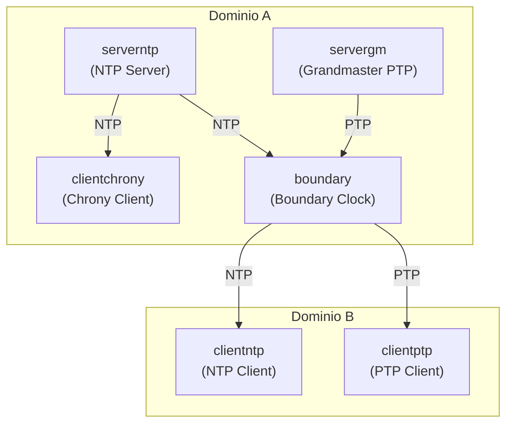

# Fase 3 — Scenari semi-realistici con disturbi (tc/netem + tbf) — Report tecnico

---

## 1. Obiettivo della fase

La Fase 3 introduce condizioni di rete degradate **riproducibili** e **parametrizzate** per stressare i protocolli di sincronizzazione temporale (PTP, NTPsec, Chrony) in scenari semi-realistici.  
Il degrado è ottenuto tramite **Linux Traffic Control (tc)** con:

- **netem**: emulazione di ritardo, jitter, perdita, riordino (impatti temporali/probabilistici).
- **tbf**: limitazione di banda (rate shaping) tramite Token Bucket Filter.

Gli scenari sono definiti come triplette/quadruple “Low/Medium/High” e applicati in modo sistematico in test separati, con log salvati per scenario.

---

## 2. Struttura dei file della Fase 3

Directory dedicata:
```text
scripts/netem/
├── scenarios/
│   ├── low.conf
│   └── medium.conf
│   └── high.conf
│   └── scenario_matrix.md
├── apply_netem.sh
├── cleanup_netem.sh
├── bootstrapT3.sh
```

---

### Razionale progettuale
- `scenarios/*.conf`: **parametri** separati dal codice → cambia lo scenario senza modificare lo script.
- `bootstrapT3.sh`: “orchestratore” che avvia topologia, applica qdisc, raccoglie log.
- `apply_netem.sh`, `cleanup_netem.sh`: utilità modulari (debug/riuso), non necessariamente parte del flusso principale.
- `scenario_matrix.md`: documento di tracciamento/descrizione degli scenari (matrice).

---

## 3. Definizione degli scenari di rete (`scenarios/*.conf`)

Ogni file `.conf` definisce un insime coerente di parametri netem + tbf

**Parametri utilizzati:*

- **`DELAY`**: ritardo medio introdotto
- **`JITTER`**: variazione causale del ritardo
- **`LOSS`**: probabilità di perdita pacchetti
- **`REORDER`**: probabilità di riordino
- **`RATE`**: limite di banda applicato tramite TBF

**Esempio scenario low.conf:*

```conf
DELAY="15ms"
JITTER="15ms"
LOSS="12.5%"
REORDER="15%"
RATE="20Mbit"
```

**Nota tecnica (formato)**
- Le unità (`ms`, `%`, `Mbit`) sono parte del parsing di `tc` e devono essere coerenti con la sintassi attesa
- Questi valori vengono importati nello script con `source`, quindi diventano variabili dispobibli nello shell coerente

## 4. Topologia di riferimetno (T2)
La fase 3 utilizza la topologia **T2**, definita in `topologies/T2/lab.conf`.

**Struttura topologica**



**Capability (cap_add)**
Esempio:
```conf
clientptp[cap_add]=SYS_TIME,NET_RAW,NET_ADMIN
```
- `SYS_TIME`: modifica/discipline dell'orologio (necessaria per PTP/NTP/Chrony se agiscono sul clock)
- `NET_ADMIN`: richiesto per `tc` (qdisc) e altre operazioni di networking avanzato
- `NET_RAW`: utile per raw sockets (alcune implementazioni e tool di rete)

La topologia è **fissa** per tutta la Fase 3; variano esclusivamente i parametri di rete

## 5. Script di utilità netem
### 5.1 `apply_netem.sh`
Script generico per applicare **singoli disturbi netem** su un'interfaccia specifica.

Caratteristiche:

- utilizza `tc qdisc replace`
    - se la qdisc root esiste, viene sosttuita;
    - se non esiste, viene creata
- supporta modalità isolate (`delay`, `loss`, `reorder`, ecc.)
- pensato come **strumento di supporto** o debugging

Non viene utilizzato nel flusso principale della Fase 3, poichè gli scenari reali richiedono l'applicazione simultanea di più parametri.
### 5.2 `cleanup_netem.sh`
Script minimale per la rimozione delle qdisc:
``` bash
tc qdisc del dev <interface> root
```
Serve a ripulire manualmente un'interfaccia senza raivviare la topologia.
Nella Fase 3 è **concettualmente contenuto**, ma di fatto superfluo poichè ogni scenario viene preceduto da `kathara lclean`.

## 6. Script principale: `scripts/netem/bootstrapT3.sh`
### 6.1 Ruolo dello script
`bootstrapT3.sh` è il **driver principale** della Fase 3.
Coordina:
- avvio e teradown della topologia
- applicazione dei disturbi
- esecuzione dei protocolli
- raccolta dei log

Lo script contiene **sezioni separate** per:
- PTP
- NTPsec
- Chrony

nota: a necessità il codice commentato per isolare altre porzioni di codice.

### 6.2 Variabili globali e setup
```bash
SCENARIOS=("low" "medium" "high")
#SCENARIOS=("low")
SCENARIO_DIR="$(dirname "$0")/scenarios"
RAWLOG="analysis/raw_logs/T3"
NETNS="boundary"
IFACE="eth1"   # boundary lato rete B
TOPOLOGY_DIR="topologies/T2"

mkdir -p "$RAWLOG"
```

- `SCENARIOS=(...)`
  Lista di scenari da eseguire. È la base per l'esecuzione batch.
- `SCENARIO_DIR="$(dirname "$0")/scenarios"`
  Calcola la directory `scenarios` relativa allo script, indipendente dal working directory.
    - `$(dirname "$0")` = directory in cui risiede `bootstrapT3.sh`
    - Questo evita path hardcoded e rende lo script portabile.
- `RAWLOG="analysis/raw_logs/T3"`
  Directory base (host/progetto) dove vengono scritti i log della fase.
- `NETNS="boundary"` e `IFACE="eth1"`
  Variabili "legacy" della parte PTP/NTPsec (dove il degrado era sul boundary lato rete B).
  **Nel blocco Chrony attivo**, invece il degrado è stato spostato su `clientchrony:eth0`.
- `TOPOLOGY_DIR="topologies/T2"`
  Path della topologia Kathara da avviare/pulire.
- `mkdir -p "$RAWLOG"`
  Crea la directory se non esiste. `-p` evita errore se già presente.

### 6.3 Blocco PTP (commentato)
La prima parte dello script contiene un ciclo `for` con la logica PTP.

Elementi chiave:
1. `source "$SCNEARIO_DIR/$S.conf"`
Importa `DELAY/JITTER/LOSS/REORDER/RATE` nello shell corrente
2. `kathara lclean è kathara lstart --previleged`
3. `./scripts/endInternetConnection`
Disconnette Internet (tipicamente spegnendo eht2 o route verso l'esterno) per garantire che la sincronizzazione avvenga solo nel lab.
4. Applicazione netem+tbf sul `boundary:eth1`:
```bash
tc qdisc replace dev $IFACE root handle 1: netem ...
tc qdisc add dev $IFACE parent 1: handle 10: tbf rate ...
```
5. Dump stato qdisc:
```bash
tc qdisc show dev $IFACE > .../netem_state_${S}_ptp.txt
```
6. Avvio PTP su servergm, boundary, clientptp con `kathara exec ... bash - lc "ptp4l ... &"`
- `bash -lc`: 
    - `-l` login shell: carica ambienete (se configurato)
    - `-c` esegue il comando
- `&` mette il processo in background nel container
- `&>` redirige stdout+stderr su file nel volume montato
7. Stabilizzazione `sleep 40`
8. `kathara lclean` finale per chiudere topologia